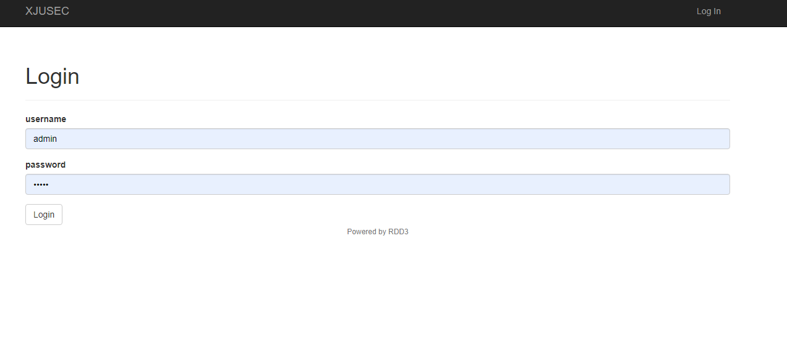
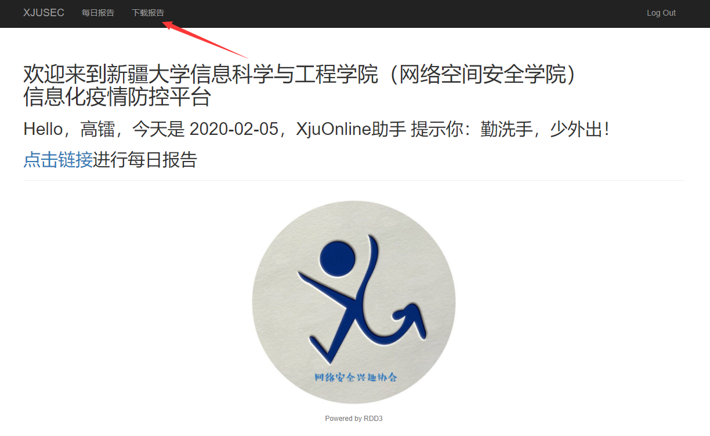
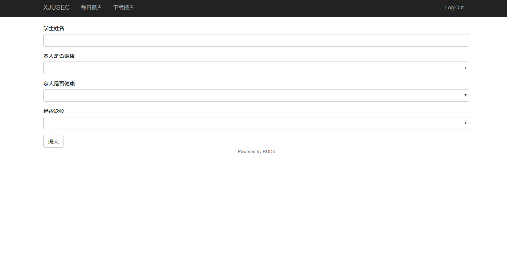
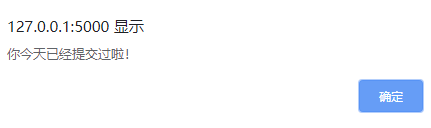
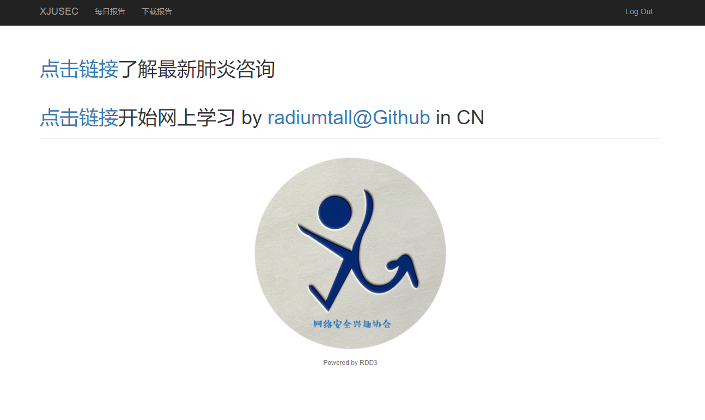
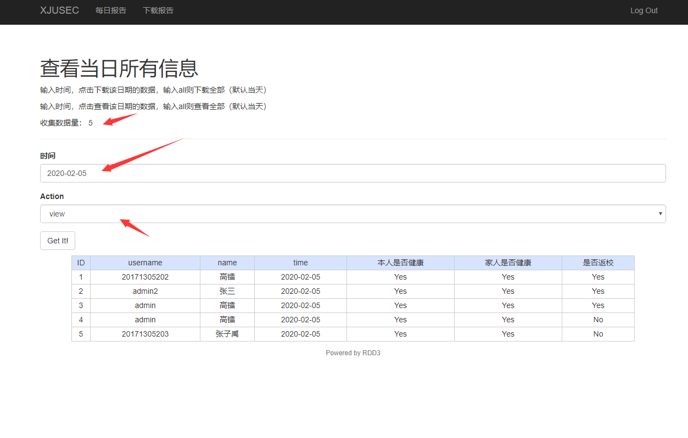
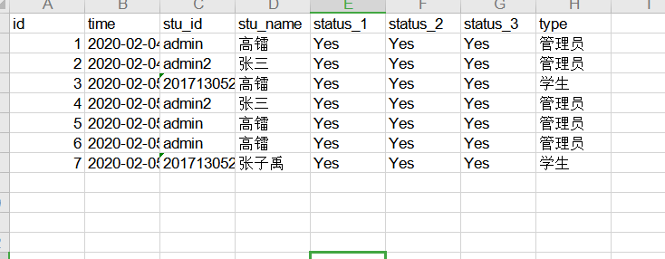

- [XjUOnline](#xjuonline)
    - [0.0](#00)
    - [ENV](#env)
    - [目录介绍](#目录介绍)
    - [Run](#run)
    - [Application](#application)
        - [Login](#login)
        - [Index](#index)
        - [User](#user)
        - [User2](#user2)
        - [Admin](#admin)
    - [Next](#next)

# XjUOnline

---

## 0.0

- Time : 20200205
- By : rdd@xjusec
- 还未进行白盒测试

---

## ENV

- system : windows10 centos
- python : python3.7
- mysql ：mysql5.0 

## 目录介绍

> app.py : 运行flask程序的入口文件

> config.py ： 存放配置文件，主要是数据库配置

> xxxy.sql : 测试用数据

> log : 记录运行时的异常，和攻击行为

> static : 存放静态文件，js，css，img等

> templates : 存放html模板文件

> appliaction : 功能目录

>> DatasDb.py : 数据库中的Datas表

>> UserDb.py : 数据库中的Users表

>> Form.py : 构建html中的表单

>> Safe.py : 检查提交数据是否有攻击行为

>> View.py : 具体实现各个页面功能

---

## Run

- 运行数据库

- ` xxxy.sql ` 导入到数据库中

- cd ` dirname `

- ` python -m pip install -r req.txt `

- 修改 ` config.py ` 文件

- 执行 ` flask run `

- 访问 ` http://127.0.0.1:5000 `

---

## Application

---

### Login

- 输入用户名密码进行Login
- 当存在sql注入时，记录日志与ip

---

### Index

- 主界面，对所有用户提供了每日报告功能

- 下载报告只提供给管理员，当学生登录时，无法使用下载功能

---

### User

- 提交报告页面，填写姓名要和学号（用户名）一致
- 一个用户一天只能提交一次

---

### User2

- 提交过后会跳转到 info 界面，提示填写信息，是否成功
- 同时提供查看疫情动态链接和学习链接（rdd@gitee）

---

### Admin

- 提供按时期查看数据和按日期下载数据

- 默认是当天数据

- 下载的数据为xls格式
- status_1 : 本人是否健康
- status_2 : 家人是否健康
- status_3 : 是否返校

---

## Next

- 提交的数据可以扩充，统计更详细的信息
- 页面美化
